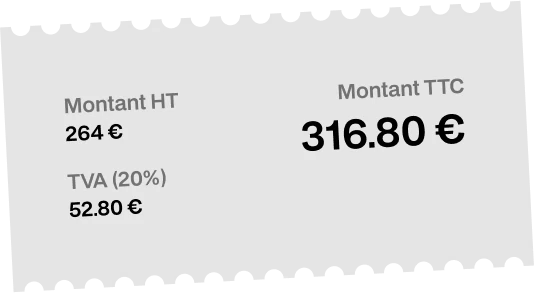

  <h1>Mon Bureau Tout Propre</h1>
  <table>
    <tr>
      <td align="left">
        
      </td>
      <td align="right">
        
      </td>
    </tr>
  </table>

## 📋 Contexte du projet

**Mon Bureau Tout Propre** est un simulateur de tarification interactif qui permet de calculer en toute transparence le coût du nettoyage de bureaux. Cet outil web offre une interface intuitive pour estimer le prix d'un service de nettoyage professionnel en fonction de différents paramètres.

Le simulateur prend en compte :

- La surface des bureaux à nettoyer (en m²)
- La fréquence du nettoyage (1x/semaine, 2x/semaine, ou tous les jours)
- Les options supplémentaires (nettoyage des fenêtres)

L'application calcule automatiquement le montant HT, la TVA (20%) et le montant TTC, affichés sous forme de ticket de tarification.

## 🛠️ Technologies utilisées

- **HTML5** - Structure sémantique de l'application
- **CSS3** - Stylisation avec variables CSS et design responsive
- **JavaScript (Vanilla)** - Logique de calcul et interactivité
- **Typographie personnalisée** - Police BDO Grotesk (format TrueType)
- **Assets** - Images SVG et WebP pour l'interface

### Fonctionnalités techniques

- Calcul en temps réel des tarifs
- Validation des données d'entrée
- Interface responsive
- Gestion des événements utilisateur
- Mise à jour dynamique de l'affichage

## Consignes pour tester le simulateur

### Prérequis

- Un navigateur web moderne (Chrome, Firefox, Safari, Edge)
- Aucune installation requise

### Étapes de test

1. **Lancement de l'application**

   **Option 1 : Version hébergée**

   - Accédez directement à l'application via GitHub Pages : [Mon Bureau Tout Propre](https://heyanto.github.io/mon-bureau-tout-propre/)

   **Option 2 : Version locale**

   - Clonez ou téléchargez le repository GitHub
   - Ouvrez le fichier `index.html` dans votre navigateur
   - Ou utilisez un serveur local (Live Server, Python SimpleHTTPServer, etc.)

2. **Utilisation du simulateur**

   **Étape 1 :** Saisir la surface

   - Dans le champ "Surface des bureaux à nettoyer"
   - Entrez une valeur en m² (ex: 80, 150, 250)

   **Étape 2 :** Choisir la fréquence

   - Sélectionnez dans le menu déroulant :
     - 1x par semaine
     - 2x par semaine (par défaut)
     - Tous les jours (5x par semaine)

   **Étape 3 :** Options supplémentaires

   - Cochez/décochez "Nettoyage des fenêtres"
   - Cette option ajoute 10% au tarif de base

3. **Vérification des calculs**

   Le ticket affiche automatiquement :

   - **Montant HT** : Surface × 1,50€ × Fréquence × (1 + 10% si vitres)
   - **TVA (20%)** : Montant HT × 20%
   - **Montant TTC** : Montant HT + TVA

### Cas de test suggérés

| Surface | Fréquence  | Vitres | Montant HT attendu | Montant TTC attendu |
| ------- | ---------- | ------ | ------------------ | ------------------- |
| 80 m²   | 2x/semaine | Oui    | 264€               | 316.80€             |
| 150 m²  | 5x/semaine | Non    | 1125€              | 1350€               |

### Fonctionnalités à tester

- ✅ Calcul automatique lors de la modification des champs
- ✅ Validation des données (valeurs négatives, champs vides)
- ✅ Réactivité de l'interface
- ✅ Affichage du ticket de tarification
- ✅ Formatage des montants (2 décimales, symbole €)

---

_Développé dans le cadre de la formation Simplon_
